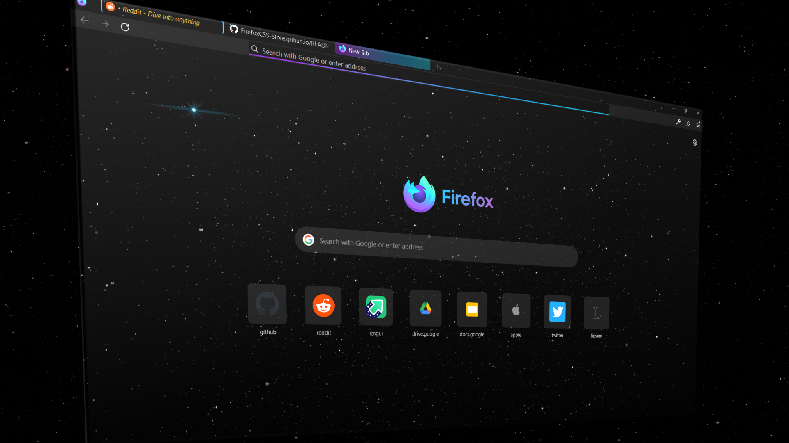
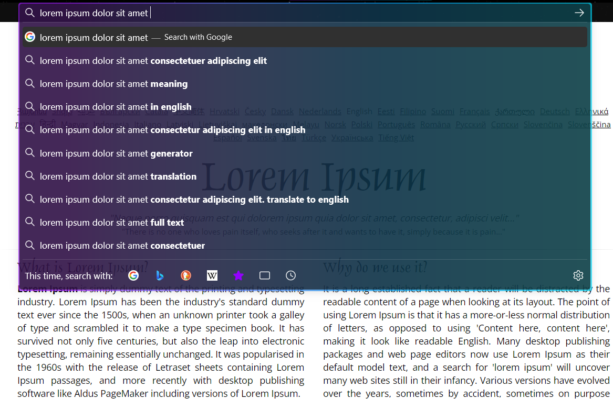
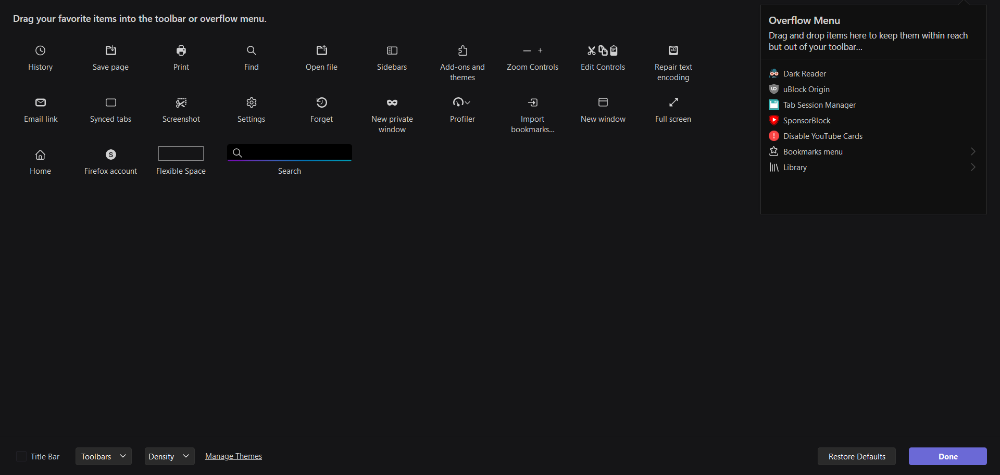
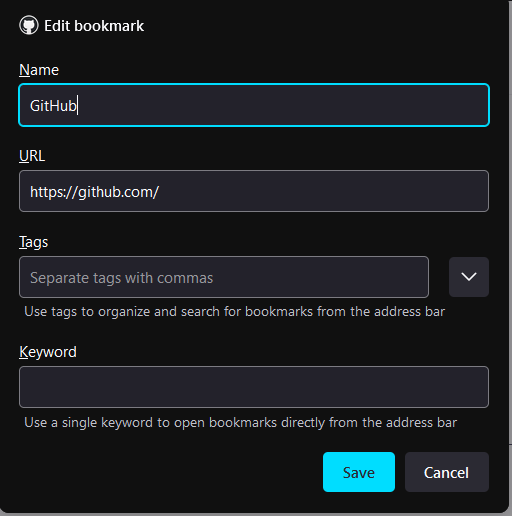
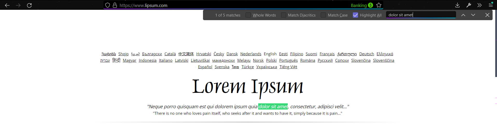
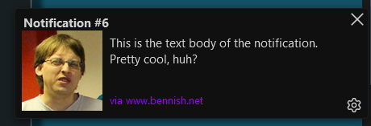
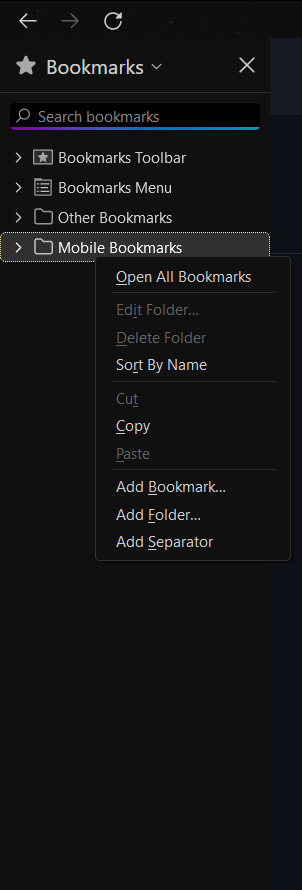

# starry-fox
Firefox css stylesheets for the dark space theme. Matching many more UI elements like sidebar, contextmenus, menupopups, dialog boxes, buttons, searchboxes, tooltips, etc.. with the theme. [Reddit](https://www.reddit.com/r/FirefoxCSS/comments/rb4ckk/starryfox_theme/?utm_source=share&utm_medium=web2x&context=3)

**To be used with the [dark space theme](https://addons.mozilla.org/en-US/firefox/addon/nicothin-space/?utm_source=addons.mozilla.org&utm_medium=referral&utm_content=rating).**

* Includes many changes such as auto-hide bookmarks bar, floating-compact findbar, newtab page with a starry sky, unread tabs indicator, new container tabs indicator, persistent sound icon on audio tab, ultra compact mode, HTML5 dark mode web notifs, rounded corners in many more menus, etc... It's all in the small details...

* Works best in proton UI compact mode dark theme. Tested in Firefox Nightly, Windows 11.

* How to use userChrome/userContent.css: https://www.userchrome.org/how-create-userchrome-css.html. 
  * P.S: Use the same chrome folder which is in the repo, so that no files will be missing. Copy the the chrome folder to the Firefox profile folder that you want to modify. If the   profile already has a chrome folder, then the chrome folders should merge. Otherwise the chrome folder will be created. The chrome folder should be in the profile root, as            mentioned in the above guide.

* For dark mode tooltips, [fx-autoconfig userChrome.js manager](https://github.com/MrOtherGuy/fx-autoconfig) must be setup. Codes for dark mode tooltips in chrome/resources/userChrome.ag.css

* Unread tabs indicator functionality requires [Tab Flag extension](https://addons.mozilla.org/en-US/firefox/addon/tab-flag/).

* Minimalistic dark scroll bars using the [Dark Scroll extension](https://addons.mozilla.org/en-US/firefox/addon/dark-scroll-for-tweetdeck/).

* Starting from Nightly build 97.0a1 (18 dec 2021), scrollbar styles can be modified using ```widget.non-native-theme.scrollbar.style``` in about:config.
  * Corresponding values:
  ```
  0. Default platform scrollbar style.
  1. macOS scrollbars
  2. GTK scrollbars
  3. Android scrollbars
  4. Windows 10 scrollbars
  5. Windows 11 scrollbars
  ```
* About config changes in [user.js](https://mkaz.blog/misc/using-firefox-user-js-settings-file/) are optional. Modify with caution.

















Thanks to @xarantolus for the container-tabs indicator.\
Thanks to @nicoth-in for the dark space theme.
